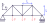
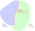
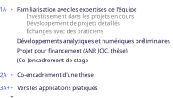

---
title: Audition pour le poste MCF n°261198
subtitle: "Section 60 - INSA Lyon (GM) - LaMCoS (MECALIPS)   Biomécanique, Méthodes numériques, Mécanique des solides et structures, Éléments finis"
format:
  quarto-ensta-revealjs: default
author:
  - name: Flavien Loiseau
    orcid: 0000-0002-6305-7309
    email: flavien.loiseau@ensta.fr
    website: floiseau.github.io
date: 05-26-2026
footer: Flavien Loiseau
margin: 0.1
resources:
  - "fonts/CenturyGothic.woff"
  - "fonts/CenturyGothic.woff2"
embed-resources: True
self-contained-math: True
bibliography: biblio.bib
title-slide-attributes: 
  data-notes: 
    Tout d'abord, je tiens à vous remercier de considérer ma candidature pour ce poste.
    Je suis très content d'être ici pour vous présenter mon profil et mes projets plus en détails.
callout-appearance: minimal
callout-icon: false
# scrollable: true
--- 

## Parcours

:::: {.columns}
::: {.column width="13%"}
2011--2014
:::

::: {.column width="87%"}
**BAC Technologique STI2D**  [(spécialité ITEC)]{.muted}
:::
::::

:::: {.columns}
::: {.column width="13%"}
2014--2016
:::

::: {.column width="87%"}
**CPGE Techniques et Sciences Industrielles**
:::
::::

:::: {.columns}
::: {.column width="13%"}

2016--2020

:::

::: {.column width="87%"}

**ENS Paris-Saclay**

:::{.muted}
- L3 pluridisciplinaire (GM, GC, GE)
- M1 Mécanique des Matériaux et des Structures
- M2 Formation à l'Enseignement Supérieure en Mécanique
- M2 Mécanique des mAtériaux pour l'inGénierie et l'Intégrité des Structures
:::
:::
::::

:::: {.columns}
::: {.column width="13%"}
2020--2023
:::

::: {.column width="87%"}
**Thèse au Laboratoire de Mécanique Paris-Saclay**

:::{.muted}
Encadrée par Rodrigue Desmorat et Cécile Oliver-Leblond
:::

:::
::::

:::: {.columns}
::: {.column width="13%"}
2024--...
:::

::: {.column width="87%"}
**Post-doctorat à l'IMSIA** (ENSTA)

:::{.muted}
Encadré par Véronique Lazarus
:::
:::
::::

:::{.notes}
- La conception et les aspects d'innovation sont ce qui m'a intéressé en premier en mécanique, c'est pour ça que j'ai choisis de suivre un bac STI2D option ITEC.
- Puis TSI
- Intégré ENS Paris-Saclay, suivi L3 pluri, puis spécialisation en méca.
- Suivi le M2 FESup
- Durant ces années, stages portant sur la simulation numérique et la dégradation mécaniques des structures. Je ne reviens pas dessus.
- Puis thèse et post-doctorat
:::

# Enseignement

:::{.large}
1 &emsp; Expériences en enseignement  
2 &emsp; Projet d'intégration  
3 &emsp; Mise en situation
:::

<!--

## Activités d'enseignement

:::: {.columns}
::: {.column width="13%"}
Avant 2020
:::

::: {.column width="87%"}
[**Divers**]{.smallcaps .example}

:::{.muted}
Aide aux devoirs (niveau lycée)  
Préparation aux examens et TP à l'IUT de Cachan (GMP)
:::

:::
::::

:::: {.columns}
::: {.column width="13%"}
2020--2023
:::

::: {.column width="87%"}
[**Mission d'enseignement**]{.smallcaps .example}
&emsp;
 ENS Paris-Saclay
&emsp;
 Génie Civil (L3, M1)
&nbsp;&nbsp;&nbsp;&nbsp;
 64h $\times$ 3 ans

Méthodes Numériques, Propagation d'ondes, Mécanique des Fluides, Matlab
 
[$\rightarrow$ Évolution formation : Sujet de TD de Méthodes Numériques.]{.muted}

:::
::::

:::: {.columns}
::: {.column width="13%"}
2024--2026
:::

::: {.column width="87%"}
[**Vacations**]{.smallcaps .example}
&emsp;&emsp;&emsp;&emsp;&emsp;&emsp;&emsp;
 ENSTA
&emsp;&emsp;&emsp;&emsp;&emsp;&nbsp;&nbsp;
 Mécanique (1A, 2A)
&ensp;&nbsp;
 42h + 51h

MMC solide élastique, Comportements non-linéaires, Fatigue, Rupture, Projet Matlab
 
[$\rightarrow$ Évolution formation : Supports numériques de TP en Mécanique de la rupture.]{.muted}
 
&emsp;&emsp; [Code Python utilisant FEniCSx + Docker (pérénisation)]{.muted .verysmaller}

:::
::::

{width=20%}

:::{.notes}
- Pour la plupart de ces modules, TD et/ou TP + corrections rapport/exam.
- Participations à des jurys de stages/projets
:::

-->

## Activités en enseignement
::::::{.columns}
:::::{.column width=60%}

:::: {.columns}
::: {.column width="20%"}
Avant 2020
:::

::: {.column width="80%"}
[**Divers**]{.smallcaps .example}

:::{.muted}
Aide aux devoirs (Lycée)  
Préparation examens et TP (IUT Cachan, GMP)
:::

:::
::::

:::: {.columns}
::: {.column width="20%"}
2020--2023
 
 3 $\times$ 64h
:::

::: {.column width="80%"}
[**Mission d'enseignement**]{.smallcaps .example} 
 
 ENS Paris-Saclay
&emsp;
 Génie Civil (L3, M1)
&emsp;

[Méthodes Numériques, Propagation d'ondes, Mécanique des Fluides, Matlab]{.muted}
 
**Évolution formation :**  
&emsp; Sujet de TD en Méthodes Numériques

:::
::::

:::: {.columns}
::: {.column width="20%"}
2024--2026
 
 42h+51h
:::

::: {.column width="80%"}
[**Vacations**]{.smallcaps .example}
 
 ENSTA
&emsp;&emsp;&emsp;&emsp;&emsp;&nbsp;&nbsp;
 Mécanique (1A, 2A)
&ensp;&nbsp;

[MMC solide élastique, Comportements non-linéaires, Fatigue, Rupture, Projet Matlab]{.muted}
 
**Évolution formation :**
 
&emsp;
Supports numériques de TP en Rupture
 
&emsp; [Code Python utilisant FEniCSx + Docker (pérénisation)]{.muted .verysmaller}

:::
::::

:::::
:::::{.column width=40%}

{width=75% fig-align="center"}

{width=40% fig-align="center"}

:::::
::::::

:::{.notes}
- Pour la plupart de ces modules, TD et/ou TP + corrections rapport/exam.
- Participations à des jurys de stages/projets
:::

<!-- 

## Évolution des formations

Illustrer les slides avec le TP (mousse) et TP MN ou Matlab Lorenz

Mettre une slide à part pour illuster l'évolution des formations ???
-->

## Intégration dans les formations
[INSA Lyon, Département Génie Mécanique]{.muted}

:::{.absolute top="8%" right="0%"}
{width=280}
:::

####  Adéquation au profil

| Thématiques                                   | Formation | Enseignement  | Recherche |
|-----------------------------------------------|:---------:|:-------------:|:---------:|
| Mécanique des solides déformables   Méthodes numériques appliquées à la mécanique   Calcul de structures par éléments finis | ✓   ✓   ✓ |✓   ✓   ✓ |✓   ✓   ✓ |
| Projets                                       | ✓         | ✓             | ✓         |
| [Conception]{.muted}                          | ✓         | -             | -         |
| [Biomécanique appliquée à la santé]{.muted}   | -         | -             | -         |

: {tbl-colwidths="[60, 13, 14, 13]"}

::::{.columns}
:::{.column}
 

####  Compétences techniques
Programmation
 
[Python, Matlab, C, Julia, etc.]{.muted .verysmaller}

Calcul scientifique
 
[GMSH, FEniCSx, FreeFEM++, SageMath, etc.]{.muted .verysmaller}

:::
:::{.column}
 
 

Logiciels métiers pour le calcul de structure
 [Cast3m, MFront, (Abaqus)]{.muted .verysmaller}

Conception Assistée par Ordinateur
 
[SolidWorks, CATIA]{.muted .verysmaller}
:::
::::

<!--
####  Enseignements visés

:::{.verysmaller}

| Année   | Activité | Élément constitutif                                    | Adéquation       |
|---------|----------|--------------------------------------------------------|:----------------:|
| FIMI 1  | TD       | Conception mécanique 1/2                               | ✓                |
| FIMI 2  | TP   Projet  | Conception-Prototypage   Conception et réalisation de prototypes | MàN   MàN |
| GM 3    | TD & TP    | Conception et dimensionnement des éléments de machines | ✓              |
| GM 4    | TD & TP   TD   TD   Projet | Conception appliquée aux systèmes mécaniques   Conception sobre des machines   Éco-conception des machines sures    Projets de conception collectifs       | ✓   ✓   ✓   MàN |
: {tbl-colwidths="[10, 10, 65, 15]"}

&emsp;&emsp;&emsp;&emsp;&emsp;&emsp;&emsp; MàN = Mise à Niveau nécessaire
:::

-->

:::{.notes}

Pour ce qui tourne autour de la MMC et des méthodes numériques, il ne me reste qu'à m'adapter aux approches pédagogiques employées dans le département.

**Mécanique des solides déformables**

- Formation + Propagation d'ondes + MMC Solides Élastiques, Mécanique des Fluides

**Méthodes numériques appliquées à la mécanique**

- Formation, Enseignements : TD/TP Méthodes numériques, TP Numériques Mécanique de la rupture, TP Numériques Méca Flu, projet Matlab

**Calcul de structures par éléments finis** en Cours/TD/TP

**Elle pourra également s’investir dans les enseignements**

- Conception
  - Formation (de la STI2D au M2 FESup)
- Biomécanique appliquée à la santé.
  - Mise à niveau nécessaire (au travers de la recherche?)

PIAE : Projet instrumentation acquisition exploitation 

Projet CC : Projet collectif de conception

Projet ETE : Projet de l’enseignement thématique électif

:::

## Implications pédagogiques

<!--
un investissement concret dans la définition et l’encadrement de projets individuels ou collectifs tels que,
les Projet Scientifique et technique & Projet Instrumentation Acquisition et Exploitation tout au long de la
3e année de GM (L3) et les projets dans les options d’orientations thématiques de 4e et 5e année (M1 -
M2), notamment l’option ingénierie de la santé, en relation avec les industriels et/ou les laboratoires
académiques associés au département.
-->

#### Évolution des enseignements

**Défis pédagogiques en Mécanique des Solides Déformables et Méthodes Numériques**  

Notions abstraites, cours en grand effectif [(peu d'interactions en cours)]{.muted}

**Contributions envisagées**

  - Illustrer les notions abstraites [(*e.g.*, contraintes)]{.muted} et les mises en œuvre numériques [(méthode num $\rightarrow$ code)]{.muted}
        &emsp;
      [Création de notebooks HTML interactifs (marimo)]{.muted}
  - Mettre en évidence les liens entre structure réelle, modélisation et simulation numérique

#### Pédagogie par projet 

 Plus d'échanges, accompagnement personnalisé, sujets variés, etc. $\rightarrow$ Envie de m'investir dans ces activités

#### Autres implications

::::{.columns}
:::{.column}
- Intégration enjeux sociétaux  
  &emsp; [*Aspects environnementaux*]{.muted}  
  &emsp; [*Intelligence artificielle*]{.muted}
- Enseignements en anglais (niveau C1)
:::
:::{.column}
- Supports pédagogiques  
  &emsp; [*Interactifs (jupyter, marimo), Accessibles (Quarto)*]{.muted}  
- À terme, responsabilités péda ou plateforme
:::
::::

:::{.notes}
Pédagogie par projet:

- C'est une manière d'enseigner dont j'ai beaucoup profité et via laquelle j'ai bcp appris.
- Formation pluridisciplinaire scientifique + encadrement de projet en recherche
:::

<!--

**Défis pédagogiques (MMC et Méthodes Numériques) **

::::{.columns}
:::{.column}
Notions abstraites  
&emsp;[Ex: contraintes, champs virtuels.]{.muted}
:::
:::{.column}
Calculatoire  
&emsp;[Ex : Calcul de structure.]{.muted}
:::
::::

::::{.columns}
:::{.column}
**Approches envisagées**  
Illustrations et ressources interactives
  &emsp;
[Physiques : Illustration de la déformation sur une éponge / mousse (grille)]{.muted}
  &emsp;
[Numériques : Marimo/Jupyter, manim.]{.muted}
  &emsp;
[TP numérique et expérimentaux complémentaires ?]{.muted}
:::
:::{.column}
 
Calcul symbolique ?  
[&emsp; Mise en pratique rapide (TP, projet).]{.muted}  
[&emsp; Proposition de ressources méthodologiques.]{.muted}
:::
::::

-->

## Mise en situation pédagogique {.center}

:::{.large}
 Cycle Ingénieur
&emsp;
 1ère année, Semestre 2
&emsp;
 Mécanique des Solides Déformables

*Mise en contexte pour le dimensionnement d’une structure treillis*

<!--
Contexte :
En ingénierie mécanique, on est souvent amené à évaluer la résistance des structures conçues en fonction des sollicitations subies.
Mise en situation :
Dans le cadre du cours Mécanique des Solides Déformables (niveau 1ère année du cycle ingénieur au département GM), il vous est demandé de faire une mise en contexte pour le dimensionnement d’une structure treillis.

Plan prévu:
1. Qu'est-ce qu'une structure treillis ?
    - Structure composé d'élements
    - Apparition avec la révolution industrielle
    - Illustration de vieille structures
    - Intérêts : légèreté, tenue mécanique, économie de matière, facilité de montage, pièces standards
2. Où est-ce qu'on les trouve maintenant ?
    - Ouvrage d'art (tours, points, bâtiments, ...)
    - Automobile (chassis/arceau) -> Formula Student -> Équipe INSA Lyon
    - Aéronautique  (membrures ailes, fuselage)
    - Énergie : Pylônes 
    - Milieux architecturés (DEAP?)
    - Concert / Tentes
3. Qu'est-ce que dimensionner une structure treillis ?
    - Géométrie, Choix de matériaux, longueurs, sections, etc.
    - En fonction des sollications (poutre: traction/compression/flexion/etc, monotone/cyclique), des contraintes (cahier des charges)
4. Exemple d'un problème de dimensionnement d'une structure treillis avec les enjeux sociétaux associés (cet exemple servira de fil rouge).
    - Cette exemple pourra être revu dans le cours (comme exemple ou traiter en TD)
5. Comment est-ce qu'on les modélise ?
    - On pourrait faire du full 3D comme on a vu dans le cours
    - En pratique, on va pouvoir supposer que les barres sont des poutres, ce qui va ÉNORMÉMENT simplifier les calculs.

Autre approche :

- Partir de la MCC 3D ???

-->
:::

## Structures en treillis - Introduction

::::{.columns}
:::{.column width=70%}

::: {.callout-important title="Définition : Structure en treillis"}
Un treillis est une structure composée de **barres** (poutres rectilignes) assemblées par des **nœuds** (liaisons rotules).
Ses liaisons avec l'extérieur sont des **appuis** (fixe ou simple).
:::

#### Autres noms

Système triangulé, système réticulé, système en treillis.

####  Avantages

Structure creuse
  &emsp;
[Utilisation optimisée de la matière (économe, légère)]{.muted}
  &emsp;
[Faible prise en vent ]{.muted}

Mise en œuvre facilitée
  &emsp;
[Utilisation d'éléments standards (poutres profilées, goussets, etc.)]{.muted}
  &emsp;
[Pré-fabrication en usine puis assemblage sur site]{.muted}

Distribution des efforts contrôlée
  &emsp;
[Réduction des concentrations de contrainte]{.muted}

:::
:::{.column width=30%}
)](figures/teaching_pont.jpg){fig-align=center width=100%}

)](figures/teaching_fuselage_Piper_PA18.jpg){fig-align=center width=100%}
:::
::::

## Structures en treillis - Transport

)](figures/teaching_ponte_dom_luis_porto.jpg){fig-align=center width=85%}

<!--
.jpg))](figures/teaching_viaduc_de_Gabarit.jpg){fig-align=center width=60%}
-->

<!--
## Structures en treillis - À Lyon

)](figures/teaching_passerelle_de_la_paix.jpg){fig-align=center height=14cm}

-->

## Structures en treillis - Bâtiment

)](figures/teaching_ferme_de_charpente_triangulee.jpg){fig-align=center height=14cm}

## Structures en treillis - Énergie

)](figures/teaching_pylone_electrique.jpg){fig-align=center height=14cm}

<!--
)](figures/teaching_eolienne_treillis.jpg){fig-align=center height=14cm}

Jacket de structures offshore

## Structures en treillis - Méta-matériaux

TODO?

Méta-matériaux

Tour fourvière

Passerelle de la Paix

## En pratique

- Les structures en treillis sont généralement assemblées avec des goussets (supposé)
- Les poutres sont généralement assemblées en formant des triangles pour assurer que les barres soient sollicitées en traction/compression.

## Structures en treillis - Exemples

- Ouvrage d'art (tours, points, bâtiments, ...)
- Automobile (chassis/arceau) -> Formula Student -> Équipe INSA Lyon
- Aéronautique  (membrures ailes, fuselage)
- Énergie : Pylônes 
- Milieux architecturés (DEAP?)
- Concert / Tentes
- Roue de vélo (pré-contrainte : )
- Divertissement : Roaller coaster

 , ça permet des structures ultra optimisées pour tenir les efforts, .
-->

## Structure en treillis - Objectifs

::::{.columns}
:::{.column width=72%}

#### Compétences visées

À partir d'un cahier des charges (chargement, masse, matériaux),

- dimensionner une structure en treillis  
    &emsp; [Mise en équation du problème de statique]{.muted}  
    &emsp; [Résolution du problème (méthodes des nœuds et des sections)]{.muted}  
    &emsp; [Réalisation de choix de dimensionnement (géomtrie, matériau, etc.)]{.muted}

::::::{.columns}
:::{.column width=54%}
#### Contenus mobilisés

- Principe fondamental de la statique
- Thèorie des poutres

#### Illustration

Cas particulier de structure en treillis
  &emsp; $\rightarrow$ structures de tenségrité.

Retour sur cet exemple plus tard !

:::
:::{.column width=46%}

)](figures/teaching_needle_tower_below.webp)
:::
::::::

:::

:::{.column width=28%}
)](figures/teaching_needle_tower_side.jpg){width=100%}
:::
::::

:::{.footer}
Attention, dans les structures de tenségrité, il y a de la pré-contrainte dans les câbles.
:::

## Structures en treillis - Modélisation
[Comment modéliser une structure en treillis ?]{.muted}

####  Problème

La modélisation 3D des solides déformables pour une structure en treillis est complexe.

::::{.columns}
:::{.column}
####  Simplification du problème
**Hypothèses simplificatrices ...**

Liaisons rotules parfaites (sans frottement)  
Liaisons avec l'extérieur par appuis (simple/glissant)

Efforts/Déplacements extérieurs imposés aux nœuds  
Pas d'efforts réparti (poids propre négligé)
:::
:::{.column}
 
**... et leurs conséquences**

$\rightarrow$
Moments de flexion nuls aux nœuds
 
 

$\rightarrow$
Pas d'efforts tranchants dans les barres
  &emsp;&emsp;
[Équilibre des forces dans la section]{.muted .verysmaller}

:::
::::

::::{.columns}
:::{.column width=60%}
#### Bilan

Les barres sont soumises à deux forces [(aux nœuds)]{.muted} :
 
elles sont donc égales, de même direction et de sens opposé.

**Les barres sont sollicitées en traction/compression.**
:::
:::{.column width=30%}
{width=100% fig-align=left}
:::
::::

Pour une **sollicitation** donnée, la modélisation relie les caractéristiques **géométriques** et **matérielles** de la structure à son **état mécanique** (efforts normaux).

<!--
**Notes**  

-> Poutre dimensionné avec la limite d'élasticité en traction et au flambage en compression (charge d'Euler).

:::{.callout-note title="Tenségrité"}
En remplaçant les barres en traction par des câbles, on obtient des structures de tenségrité, souvant très *design*.
:::
-->

## Structures en treillis - Dimensionnement
[En quoi consiste le dimensionnement d'une structure en treillis ?]{.muted}

::::{.columns}
:::{.column width=35%}

#### Exemple

)](figures/teaching_pont.jpg){fig-align=center width=90%}

{fig-align=center width=100%}
:::

:::{.column width=5%}
:::

:::{.column width=60%}
#### Dimensionnement

Le **dimensionnement des structures en treillis** consiste à choisir :

- la géométrie du treillis,
- les matériaux des barres,
- la section des barres,

en fonction de différentes **contraintes** telles que

- garantir la tenue mécanique sous des solllicitations données,
    &emsp;
  [*Ex: Supporter une charge maximale donnée pour un pont.*]{.muted .verysmaller}
- limiter le volume de matière ou la masse de la structure,
    &emsp;
  [*Ex : Optimiser le volume de matière d'un pylône (280k en France)*]{.muted .verysmaller}
- obtenir une rigidité spécifique.
    &emsp;
  [*Ex : Garantir une faible flèche pour une grue*]{.muted .verysmaller}
:::
::::

# Recherche

:::{.large}
1 &emsp; Expériences en recherche  
2 &emsp; Projet d'intégration
:::

## Thèse au LMPS

:::: {.columns}

::: {.column width="25%"}
**2020--2023**

{width="20%" .absolute top=18%}
:::

::: {.column width="75%"}
**Formulation de l'endommagement anisotrope des matériaux et stuctures quasi-fragiles basée sur la simulation discrète de la fissuration**  
R. Desmorat, C. Oliver-Leblond  
[*2 articles, 2 conférences internationales, 1 conférence nationale, 2 GdR.*]{.muted}
:::
::::

[ Model damage in micro-cracking material $\boldsymbol{\sigma} = \tilde{\mathbf{E}}(\mathbf{D}) : \boldsymbol{\varepsilon}$ from discrete simulations]{.alert .large}

::::{.columns}

:::{.column width=33%}
#### 1. Discrete simulations

::: {layout-ncol=2}

 
21 loads  
36 $\mu$-structures
$\to$ 76k steps

{width=3.5cm}

{width=3.5cm}

{width=3.5cm}

:::

:::

:::{.column width=33%}
#### 2. Effective elasticity tensors

{width=100%}

 Analysis of symmetry classes
:::

:::{.column width=33%}

#### 3. Modelling

a. Damage definition
    $$\mathbf{D} = \mathbf{1} - \frac{1}{\kappa_0} \mathrm{tr}_{12} (\mathbf{E})$$
b. Harmonic decomposition  
    {width=100% fig-align=center}

:::
::::

:::{.footer}
 @loiseau_anisotropic_2023 and @vedrine_calibration_2025 &emsp;  Dataset: [https://doi.org/10.57745/LYHM4W](https://doi.org/10.57745/LYHM4W)
:::

:::{.notes}
- Endommagement anisotrope des matériaux quasi-fragiles (hétérogènes)
- Basé sur simulation discrète (voir figure) représentant explicitement la micro-fissuration
- Idée : mesurer l'évolution du tenseur d'élasticité d'un VER sous différents chargements
- Ensuite, analyse via outils mathématiques (distance aux classes de symétrie)
- Ensuite, définition d'une variable d'endo puis formulation de la loi d'état : tenseur d'élasticité en fonction de l'endo via la décomposition harmonique.
- Cas de l'évolution : traité mais pasz abouti.
:::

## Postdoc at IMSIA - Overview

:::: {.columns}
::: {.column width="25%"}
**2024--Now**

{width="70%" fig-align="left"}
:::

:::{.column width="75%"}
**Theoretical and numerical study of crack propagation   in heterogenous and/or anisotropic materials**  
V. Lazarus  
[*2(+3) articles, 4(+2) international conferences, 3 national conferences.*]{.muted}
:::
::::

[** Open-source codes for anisotropic crack propagation in 2D**]{.alert .large}

::::{.columns}
:::{.column width=42%}

 

[[ **floiseau/gcrack**]{.example}](https://github.com/floiseau/gcrack) [(LEFM^[LEFM = Linear Elastic Fracture Mechanics])]{.muted}

[[ **floiseau/fragma**]{.example}](https://github.com/floiseau/fragma) [(phase-field)]{.muted}

**Main features**

::::::{.columns}
:::::{.column width=50%}
- Load control   [(path-following)]{.muted}
- Fracture anisotropy
:::::

:::::{.column width=50%}

- Heterogeneities [(fragma)]{.muted}
- Fatigue [(gcrack)]{.muted}

:::::
::::::

:::

:::{.column width=58%}

{width=100%}

:::
::::

## Postdoc at IMSIA - Numerical aspects

[ Develop robust numerical tools for crack propagation in anisotropic materials]{.alert .large}

::::{.columns}

:::{.column width=33%}

#### Load control 

**Path-following & fracture**  
 @loiseau_path-following_2026

Force load + Fracture = Instable  
[$\rightarrow$ Novel path-following method]{.muted}

{width=100%}

:::

:::{.column width=66%}

#### Limiting numerical bias in phase-field simulations of fracture

::::::{.columns}
:::::{.column width=38%}
**Initial cracks**

 @loiseau_how_2025

:::{.muted}
$\rightarrow$ Unbiased initial crack   &emsp;&nbsp; in phase-field fracture
:::

:::::

:::::{.column width=61%}
{width=100%}
:::::
::::::

::::::{.columns}
:::::{.column width=38%}
**Mesh-induced bias**

[ E. Zembra \& H. Henry (PMC)]{.verysmaller .muted}

[$\rightarrow$ Quantify mesh bias   &emsp;&nbsp; in crack path pred]{.muted}
:::::

:::::{.column width=61%}
{width=100%}
:::::
::::::

:::

::::

## Postdoc at IMSIA - Applications

[ Predict crack propagation in real systems]{.alert .large}  

::::{.columns}

:::{.column width=50%}

#### Collaborations with experimenters

::::::{.columns}

:::::{.column width=57%}
**Fracture in rotating structures**  
[ G. Yakir \& P. Reis (EPFL)]{.verysmaller .muted}

:::{.muted .verysmaller}
- Determination of the crack propagation threshold
:::
:::::

:::::{.column width=43%}
{width=100%}
:::::
::::::

:::

:::{.column width=50%}

 

**Fracture in 3D-printed structures**   
[ IMSIA]{.verysmaller .muted}

:::{.muted .verysmaller}
&emsp; Duplex steel (D. Roucou \&  N. Habib)  
&emsp; Polycarbonate (X. Zhai)  
&emsp; Repaired steel structures (L. Kiakouama)  
&emsp; Specimen design (K. Paquet)
:::

**Others**
&emsp; 
[Mixed mode fracture in PMMA (D. Roucou)]{.muted .verysmaller}

::::

::::{.columns}
:::{.column width=50%}

#### Other collaborations

**Sparse analytical regressions** 
[ Safran Aircraft Engines (discussion for applications)]{.verysmaller .muted}  
[&nbsp;&nbsp; Applications : Fracture in rotating structures]{.verysmaller .muted}  
&nbsp;&nbsp;&nbsp;&emsp;&emsp;&emsp;&emsp;&emsp;&emsp; [Revisiting fracture mechanics handbooks]{.verysmaller .muted}  
 Finding a sparse analytical expression from data  
[&emsp; Simplicity vs accuracy tradeoff]{.muted .verysmaller}

<!--
1. Problem
2. Analysis (dimensionless function we want to determine)
3. Data collection (numerical)
4. Sparse regression results: analytical approximation.
-->

:::

:::{.column width=50%}

::::::{.columns}
:::::{.column width=55%}
**Optimization of dissipation during crack propagation**  
[ J. Triclot (LMA)]{.verysmaller .muted}

:::::

:::::{.column width=43%}
:::{.muted .verysmaller}
- Simulation of crack propagation   with load control
:::
:::::
::::::

{width=64% fig-align=center}

:::

:::
::::

<!-- 
## Encadrements

**TODO** Changer en "Autres implications" (encadrements + science ouvertes + animation scientifique + reproductibilité + compétences numériques)

::::{.columns}

:::{.column}

#### Effect of crack distribution on the elasticity tensor
[*2022 - A. Marlot - M1 ENS Paris-Saclay*]{.muted}

{fig-align=center width=100%}

#### Study of size effect in discrete simulation
[*2023 - L. Védrine - M2 ENS Paris-Saclay*]{.muted}

{fig-align=center width=80%}
:::

:::{.column}

#### Phase-field simulations of anisotropic fracture
[*2024 - A. Ecotiere - 2A ENSTA*]{.muted}

 

#### Crack propagation in mixed mode I+II in CCT specimen
[*2025 - Y. M. V. Epongue Djeugoue - 2A ENSTA*]{.muted}
[*Experiments by D. Roucou at IMSIA.*]{.muted .verysmaller}

{width=89% fig-align=center}

{fig-align=center autoplay=true loop=true width=100%}

:::

::::

-->

## Autres implications en recherche

::::{.columns}

:::{.column}

#### Encadrement de stages

2022 - A. Marlot - M1 ENS Paris-Saclay
  &emsp;
[Effect of crack distribution on the elasticity tensor]{.muted .verysmaller}

2023 - L. Védrine - M2 ENS Paris-Saclay
  &emsp;
[Study of size effect in discrete simulation]{.muted .verysmaller}

2024 - A. Ecotiere - 2A ENSTA
  &emsp;
[Phase-field simulations of fracture in 3D-printed steel]{.muted .verysmaller}

2025 - Y. M. V. Epongue Djeugoue - 2A ENSTA
  &emsp;
[Crack propagation in mixed mode I+II in CCT specimen]{.muted .verysmaller}

:::

:::{.column}

{width=89% fig-align=center}

{fig-align=center autoplay=true loop=true width=100%}

:::
::::

::::{.columns}
:::{.column}
####  Animation scientifique

Organisation de séminaires

- Réunion équipe COMMET (LMPS) &emsp;&emsp; 2 ans
- Séminaire interne Pôle Mécanique &emsp;  1.5 ans   &emsp;
    [Lancement, multi-laboratoire : IMSIA, LMI, LMS, LadHyX]{.muted .verysmaller}

:::

:::{.column}

####  Sciences ouvertes

- Publication codes/données avec chaque article
- Publication dans JTCAM [@loiseau_how_2025]
- Présentation sur site perso

:::
::::

<!--
**TODO** Changer en "Autres implications" (encadrements + science ouvertes + animation scientifique + reproductibilité + compétences numériques)
Animation scientifique

Autres

- Création et gestion de code collaboratifs
- Intérêt pour la science ouverte
-->

## Intégration en recherche
[*Équipe MECALIPS du LaMCoS*]{.muted}
 

:::{.alert .large}
 **Objectif global**  
Modéliser et simuler les mécanismes physiopathologiques de maladies chroniques
:::

:::{.absolute top="0%" right="0%"}
{width=280}
:::

####  Verrous et propositions

**Comment modéliser les tissus biologiques (et des implants) ?**
  &emsp;
 Développer des modèles de comportements dédiés dans un cadre générique
  &emsp; &emsp;
[Cadre de modélisation macroscopique modulaire basé sur la thermodynamique]{.muted .verysmaller}
  &emsp; &emsp;
[Modéles continus (classique ou *data-driven* interprétable) ou discrets à plusieurs échelles]{.muted .verysmaller}
  &emsp; &emsp;
[Couplages bio-chimio-mécaniques (dégradation, croissance, remodellage, etc.), anisotropie, hétérogénéités]{.muted .verysmaller}

**Comment simuler les maladies étudiées et leur développement de manière robuste et personnalisable ?**
  &emsp;
 Développer des outils numériques s'appuyant sur le cadre de modélisation générique
  &emsp; &emsp;
[Solveurs non-linéaires/minimisation adaptés au cadre de modélisation]{.muted .verysmaller}
  &emsp; &emsp;
[Mise en données à partir des données médicales disponibles]{.muted .verysmaller}
  &emsp; &emsp;
[Vers des outils adaptés au milieu clinique (performances, etc.)]{.muted .verysmaller}

####  En collaboration

::::{.columns}
:::{.column}
Conceptualisation d'expériences
:::
:::{.column}
Vers des méthodes numériques efficaces  &emsp; [Solveurs optimisés, réduction de modèle]{.muted .verysmaller}
:::
::::

:::{.notes}

Avant de commencer, j'aimerais revenir sur deux points.
Le premier est bien sûr que je n'ai jamais fait de biomécanique, mais si je suis ici c'est parce que c'est un domaine qui m'intéresse particulièrement par ses enjeux applicatifs et les défis scientiques qu'il pose.
Le second point est que j'ai adapté mon projet d'intégration par rapport au dossier pour prendre en compte que l'axe valcusculaire est arrêter.

La physiopathologie est une discipline de la biologie qui traite des dérèglements de la physiologie, c’est-à-dire les dérèglements du mode de fonctionnement normal des éléments constitutifs du corps humain, d'un animal ou d'un végétal. La physiopathologie envisage à la fois les mécanismes physiques, cellulaires ou biochimiques qui conduisent à l'apparition d'une maladie et les conséquences de celle-ci. 

####  Enjeux visés

- Amélioration des méthodes de diagnostic et de l'évaluation des risques (TODO)
- Développement et personnalisation des traitements préventifs/thérapeutiques

#### Création d'un outil de simulation

Observation -> Modélisation -> Résolution/Simulation -> Optimisation de la résolution

Je me place dans modélisation et au début de résolution/simulation.

:::

<!--

L'**objectif** de l'équipe MECALIPS est de

- comprendre les mécanismes physiopathologiques de maladies chroniques (de l’échelle moléculaire à macroscopique)

L'**approche** employé consiste à  

- étudier des réactions biologiques, chimiques et mécaniques à des sollicitations biologiques, chimiques et mécaniques

**dans le but de permettre**

- la réalisation d'un diagnostic précoce,
- le développement de stratégies préventives ou thérapeutiques.

#### Types de maladies

 
[ **Objectif global   Modéliser et simuler les tissus biologiques**]{.large .alert .smallcaps}
 

## Intégration dans l'équipe MECALIPS

#### NOTE : Pas d'experience en bio-mécanique

Mais ce sont des thématiques auxquelles je me suis intéressé (travaux de recherche à l'IMSIA, conférences)

Thématiques qui m'attire en terme d'enjeux associés et en terme de science (les approches utilisés pour les matériaux industriels ne sont pas forcément adaptés)

+ Composer avec les thématiques de l'équipe !

#### Idée globale

Développer des cadres théoriques et outils numériques adaptables à différentes problématiques

- Cadre de modélisation générique :
    - méthode variationnel incrémentale -> MSG, potentiellement des extensions si nécessaire de développer des modèles non-standards
    - aussi possible de contribuer à des approches multi-échelles -> modèles discrets
    - Applicaiton : modélisation des tissus biologiques, couplages multi-physiques,
    - ce cadre sert pour la recherche, ensuite on peut créer des outils spécifiques optimisés pour les praticiens.
- Outils numériques adaptées à ce cadre
    - calibration
    - réduction de modèle (utilisant le cadre générique proposé)

####  Verrous scientifiques et propositions

::::{.columns}
:::{.column width=78%}

**Comment modéliser le comportement des tissus biologiques (et des implants) ?**  
&emsp; Développer des modèles de comportements dédiés  
[&emsp;&emsp;&emsp; Phénomènes : endommagement, chimio-mécanique, cicatrisation, remodelage, etc.]{.muted .verysmaller}  
[&emsp;&emsp;&emsp; Propriétés : anisotropie, hétérogénéités, etc.]{.muted .verysmaller}  
[&emsp;&emsp;&emsp; Prise en compte des phénomènes complexes (endommagement, couplage chimio-mécanique, remodelage, etc) avec des propriétés complexes (anisotropie, Hétérogénéités).]{.muted .verysmaller}  
[&emsp;&emsp;&emsp; Approches : classique, *data-driven* (interpretable, contrainte par la physique).]{.muted .verysmaller}  

**Comment simuler les maladies étudiées de manière robuste et adaptable ?**  
&emsp; Développer un cadre numérique générique  
[&emsp;&emsp;&emsp; Établir un cadre unifié pour les comportements -> généralisation des contributions suivantes]{.muted .verysmaller}  
[&emsp;&emsp;&emsp; Calibration des modèles à partir des données médicales disponibles]{.muted .verysmaller}  
[&emsp;&emsp;&emsp; Rendre les outils numériques utilisables par les praticiens (modèles réduits ou simplifiés)]{.muted .verysmaller}  

:::
:::{.column width=22%}
{fig-align=center width=100%}

:::
::::

-->

## Cadre de modélisation et simulation

::::{.columns}
:::{.column width=82%}

####  Approche variationnelle incrémentale 
<!-- cube cubes pen-to-square crop-simple expand -->

L'état physique des tissus est décrit par la minimisation d'un potentiel énergetique
$$
\mathcal{P}(\boldsymbol{u}, ...) = 
\mathcal{P}_{\Omega_1}(\boldsymbol{u}, ...) +
\mathcal{P}_{\Omega_2}(\boldsymbol{u}, ...) + 
\mathcal{P}_{\partial \Omega_{1/2}}(\boldsymbol{u}, ...)
$$

**Intérêts** : thermodynamique, cadre numérique modulaire, etc.

:::
:::{.column width=18%}
{width=100%}
:::
::::

::::{.colomns}
:::{.column}
####  Modélisation [= formulation du potentiel]{.muted .verysmaller}

Collecte des données
  &emsp;
[Expériences (collab)]{.muted .verysmaller}
  &emsp;
[Approche multi-échelle]{.muted .verysmaller}

Choix des variables d'état
  &emsp;
[Dépend des physiques et interactions à modéliser]{.muted .verysmaller}

Formulation du potentiel
  &emsp;
[Continue (analytique, *data-driven* interprétable), discrète]{.muted .verysmaller}
  &emsp;
[Théorie des invariants (anisotropie)]{.muted .verysmaller}

**Vers les couplages bio-chimio-mécaniques**

<!--
Exemples de modèles existants

- Thermo-méca des MSG^[Matériaux Standads Généralisés] [@yang_variational_2006]
- Thermo-poro-mécanique + Endommagement [@kamagate_incremental_2025]
-->

:::
:::{.column}
####  Simulation numérique [= minimisation du potentiel]{.muted .verysmaller}

Minimisation
  &emsp;
[Solveur non-linéaire / optimisation]{.muted .verysmaller}
  &emsp;
[Appui sur outils *open-source* (FEniCSx)]{.muted .verysmaller}

Simulations patient-spécifiques
  &emsp;
[Mise en données à partir de données médicales]{.muted .verysmaller}
  &emsp;
[Solution numérique différentiable (calibration/optimisation)]{.muted .verysmaller}

Performances
  &emsp;
[Utilisation de bases réduites (collab réduction de modèle)]{.muted .verysmaller}

**Vers des simulations efficaces et personnalisées**

:::
::::

:::{.notes}
Bases réduites $\rightarrow$ complexe avec phénomènes localisés.
:::

## Intégration dans l'axe bucco-dentaire

:::{.large .alert}
 Prédire le risque de lésion dentaire / rupture d'implant
:::

::::{.columns}
:::{.column width=30%}
#### Répresentation de base
 
{width=100%}
:::
:::{.column width=5%}
:::
:::{.column width=65%}
#### Démarche

1. Modélisation du contact  
    [&nbsp;&nbsp; Contact approché : Third Medium Contact [@wriggers_finite_2013].]{.muted .verysmaller}  
1. Modélisation du comportement des tissus dentaires et implants  
    [&nbsp;&nbsp; Approche multi-échelle par modèles discrets (émail)]{.muted .verysmaller}  
    [&nbsp;&nbsp; Anisotropie, endommagement (méca/chimique), usure, etc.]{.muted .verysmaller}  
3. Simulation du contact dentaire  
    [&nbsp;&nbsp; Vers l'adaptation : morphologie, implant, etc.]{.muted .verysmaller}  

#### Exemple d'application

- Simulation de la fissuration dentaire [(monotone/cyclique)]{.muted .verysmaller} 
    [&emsp; Initiation/Propagation de fissure  ]{.muted .verysmaller}
    [&emsp; Prise en compte de défauts morphologiques / malocclusion  ]{.muted .verysmaller}

#### Extensions

Érosion dentaire, Cicatrisation et remodellage osseux (implant), Modélisation complète de la machoire/crâne

<!--

En pratique, ça contribuera à 

- Mieux prédire le risque de lésion
- Mieux concevoir les implants
 
Étudier l'effet de la morphologie occlusal sur le risque de lésions dentaires.

1. Modélisation de l'endommagement
    a. Essai/Approche multi-échelles
    b. Enamel -> anisotropic behavior

2. Simulations
    - initiation de fissures (modèle d'endo)
    - propagation de fissure / d'un défaut existant ?  endo/rupture/fatigue
    - Contact (TMC) -> contact traiter comme un comportement

3. Vers des applications spécifiques

Extensions:
  1. Cas de malocclusion
  2. Implants hétérogènes (inclusions) résistants à la rutpure ??? -> travaux avec Julie
  3. Bio-chimie -> endommagement surfacique de la dent, création de défauts.
  4. Vers des calculs de structures réaliste : modélisation fine des différents tissus biologiques
  3. Influence des pores (implants avec défauts, mauvais montage) ?
  4. Account for wear ?
  5. Effect of bone remodelling on implant ?
  6. Effet de la malocclusion sur le crâne (via la liaison mandibule crane) ?
  7. Croissance et remodellage après la pose d'un implant

Which cracks are susceptible of crack propagation (and further problem) : stability of crack propagation + fatigue ??
--> 

:::
::::

## Intégration dans l'axe articulaire

:::{.large .alert}
 Prédure l'usure d'une prothèse de hanche et son influence sur son environnement
:::

::::{.columns}
:::{.column width=30%}
#### Prothèse de hanche

:::
:::{.column width=5%}
:::
:::{.column width=65%}
#### Démarche

1. Modélisation macroscopique de l'usure des prothèses
      &emsp;
    [ Modélisation discrète discrète de l'interface de contact]{.muted .verysmaller}
      &emsp; 
    [Modèle macroscopique de l'usure (*e.g.*, loi de Archard + $r$-adaptation)]{.muted .verysmaller}
      &emsp; 
    [Effet des phospholipides sur le contact et l'usure]{.muted .verysmaller}

2. Transport (et réactions ?) des particules $\rightarrow$ interface et tissus proches
      &emsp;
    [Élements discrets pour modéliser l'usure et le transport]{.muted .verysmaller}

#### Exemple d'application

- Compréhension et évaluation des risques risques liés à l'usure
- Validation d'implants personnalisés
      &emsp;
    [Évaluation de la tolérance aux défauts de l'implant (fissures)]{.muted .verysmaller}

:::
::::

<!--

#### Autres applications envisagées

Modélisation poro-mécanique du cartilage articulaire + endommagement + couplage chimio-mécanique + 

Évaluation de la tenue mécanique des implants : modélisation du comportement, usure ?

But: Simuler l'endommagement et la "cicatrisation" du cartilage

Se baser sur les données issues du bio-tribomètre.

#### Actions

1. Participer aux efforts de modélisation à l'échelle moléculaire du réseau de collagène + des traitements
2. Formuler un modèle de comportement poro-mécanique (fluide=...) grande déformations avec endommagement et cicatrisation (issue de réaction bio-chimiques).
    Modélisation discrète du collagène et de son endommagement ? Modèle lattice hyper-elatstic + Influence de la bio-chimie

#### Autres applications 

Resorption osseuses + relachement de particule lors du changement de prothèse.

Ex: Couple céramique (prothèse ceramic on ceramic, composite alumine-zircone) -> Modélisation discrète de la micro-fissuration et de l'usure

-> Initiation de fissure, propagation de fissure (initiée par le procédé ou par le )

Ceci permettra ensuite, dans un deuxième objectif, de maîtriser les interactions mécaniques et physicochimiques de ces assemblages moléculaires avec les surfaces des implants articulaires et les tissus adjacents (os / cartilage) afin d’estimer de manière réaliste la durée de vie des implants et de concevoir des solutions thérapeutiques moins handicapantes qu’une arthroplastie totale.

Des modèles numériques simulant la transmission des contraintes mécaniques multi-échelles (de l’organe : articulation, à la cellule : chondrocytes / ostéocytes) permettront d’optimiser les nouvelles solutions thérapeutiques afin d’obtenir une adaptation parfaite au patient autant de point de vue mécanique que biologique (patients sportifs, dégénératifs ou inflammatoires) et garantir ainsi leur durée in vivo. 

-->

<!--

## Exemple de projet 2

Modélisation du comportement

Couplage bio-chimio-mécanique ???

Bio-chimia-mécanique des tissus neuronnaux ???

Elastography : decrease in viscoelastic properties of the brain in Alzheimer's disease -> loss of viscoelastic integrity due to degeneration of neurons. -> Idea : Find simpler diagnostic protocol ?
+ Effect of anisotropy -> changes with age

Objectif : Modéliser l'effet de la perturbation bio-chimique sur les propriétés mécaniques (qui peuvent être un marqueur indirect de la "santé" des neuronnes)

Culture de neuroblastome + lipide/pollution -> changement des propriétés biologiques et mécaniques ?

-->

## Projet spécifique : Démarche

 

{fig-align=center height=12cm}

<!--

 Limitations: Modèles non-standards =S

Démarche:

- 1A:
    - Prise en main des thématiques de l'équipe (réunions, discussions, etc.)
    - Mise en place de projets détaillés
    - Développements théoriques et numériques préliminaires
    - Préparation d'un projet de recherche (ANR JCJC, financement stage)
    - Encadrement stage M2 en fin de 1ère année
- 2A:
    - Co-encadrement d'un thèse, postdoc
- 3A:
    - Co-encadrement d'un thèse, postdoc

::::{.columns}
:::{.column width=65%}

####  Implémentation numérique

**FEniCSx** avec solveurs non-linéaire (PETSc/TAO)  
[&emsp; $\rightarrow$ Si instabilités numériques : régularisation ou gradient de Sobolev.]{.muted}
:::

:::{.column width=35%}
{height=2.5cm}
&emsp;
{height=2.5cm}
:::
::::

::::{.columns}
:::{.column}

####  Démarche

{fig-align=center width=83%}

:::

:::{.column}

#### Intérêt

Cadre numérique générique pour traiter des problèmes de contacts sous-sollicitations extrêmes.

#### Limites

Glissement/roulement $\implies$ Distorsion du maillage  
[&emsp; $\rightarrow$ $r$-adaptation du maillage ?]{.muted}

#### Autre application

Simulation de procédés de fabrication

:::

::::

-->

## Synthèse

#### Intégration en enseignement {style="margin-top: 25px;"}

::::{.columns}

:::{.column #vcenter width=60%}

- Formation à l'enseignement
- Expériences (ENS Paris-Saclay, ENSTA)
- Intérêt pour la pédagogie active

:::

:::{.column #vcenter width=40%}
🎓 **Génie Mécanique**  
Mécanique des solides déformables  
Méthodes numériques pour la mécanique  
Projets

:::
::::

#### Intégration en recherche {style="margin-top: 25px;"}

::::{.columns}
:::{.column width=60% #vcenter}
[Modèles]{.example} et [outils numériques]{.example} pour la simulation prédictive    des tissus biologiques et implants   sous sollicitations bio-chimio-mécaniques.
:::

:::{.column width=40% #vcenter}

**Engagements**  
Sciences ouvertes  
Animation scientifique

:::

::::

:::{.absolute bottom="13%" left="8%"}
[Merci pour votre attention !]{.example style="font-size: 200%;"}
:::

:::{.absolute bottom="2%" right="10%"}
{fig-align="center" width=125px}
:::

## References

::: {#refs}
:::

